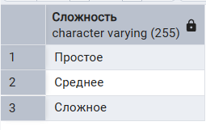
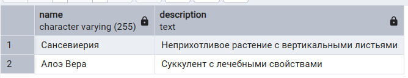
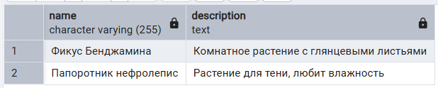

SELECT-запросы

1. Выборка всех данных из таблицы

1.1. Вывести все растения, имеющиеся в базе данных
```sql
select * from main.plant;
```


1.2. Вывести все типы полива
```sql
select * from refs.watering;
```


2. Выборка отдельных столбцов

2.1. Вывести названия удобрений и способ их применений
```sql
select name, usage from main.fertilizer;
```


2.2. Вывести дополнительные характеристики с информацией, безопасны ли они
```sql
select name, safety_flag from refs.feature;
```


3. Присвоение новых имен столбцам при формировании выборки

3.1. Вывести советы в столбце «Совет»
```sql 
select tip_text as Совет from main.advice;
```


3.2. Вывести имеющиеся сложности ухода
```sql
select type as Сложность from refs.difficulty;
```



4. Выборка данных с созданием вычисляемого столбца (математические функции)

4.1. Вывести растения, подходящие для детей (небольшие и легкие в уходе)
```sql 
select name, description, 
	(size_id * difficulty_id <= 2) as "Подходит для ребенка"
from main.plant;
```


4.2. Вывести растения и вероятность домашнему животному отравиться, съев его
```sql
select name, description,
	(100 * (safety_id * size_id) / 6) as "Вероятность отравиться"
from main.plant;
```


5. Выборка данных с созданием вычисляемого столбца (логические функции c CASE)

5.1. Вывести растения и подходит ли оно для ребенка
```sql 
select name, description, 
	CASE
		WHEN size_id * difficulty_id < 2 THEN 'Идеально подходит'
		WHEN size_id * difficulty_id = 2 THEN 'Подходит'
		ELSE 'Не подходит' 
	END as "Подходит для ребенка"
from main.plant;
```


5.2. Вывести растения и стоит ли его брать, если в доме есть домашнее животное
```sql
select name, description,
	case 
		when (100 * (safety_id * size_id) / 6) > 50 then 'Нет'
		when (100 * (safety_id * size_id) / 6) > 35 then 'Можно попробовать'
		else 'Точно стоит'
	end as "Стоит ли брать?"
from main.plant;
```


6. Выборка данных по условию

6.1. Вывести самые легкие в уходе растения
```sql 
select name, description
from main.plant
where difficulty_id < 2;
```


6.2. Вывести безопасные дополнительные характеристики
```sql
select name, description
from refs.feature
where safety_flag = true;
```


7. Выборка данных по условию (логические операции)

7.1. Вывести растения, подходящие для новичков-цветоводов
```sql 
select name, description
from main.plant
where size_id < 3 and difficulty_id = 1;
```


7.2. Вывести растения, съев которые можно отравиться
```sql
select name, description
from main.plant
where (100 * (safety_id * size_id) / 6) > 50;
```


8. Выборка данных, оператор BETWEEN

8.1. Вывести небольшие растения
```sql 
select name, description
from main.plant
where size_id between 1 and 2;
```


8.2. Вывести растения, которые нужно много поливать
```sql
select name, description
from main.plant
where watering_id between 2 and 3;
```


9. Выборка данных, оператор IN

9.1. Вывести растения, которые могут жить в холоде
```sql 
select name, description
from main.plant
where temperature_id in (1, 3);
```


9.2. Вывести дополнительные характеристики, которые максимально/минимально выражены 
```sql
select name, description
from refs.feature
where intensity_level in ('1', '5')
```


10. Выборка данных с сортировкой

10.1. Вывести растения в порядке возрастания сложности
```sql 
select name, description
from main.plant
order by difficulty_id;
```


10.2. Вывести растения в порядке уменьшения размера
```sql
select name, description
from main.plant
order by size_id desc;
```


11. Выборка данных, оператор LIKE

11.1. Вывести растения, названия которых состоят из двух слов
```sql 
select name, description
from main.plant
where name like '% %';
```


11.2. Вывести растения, в названиях которых есть буква «Ф» любого регистра
```sql
select name, description
from main.plant
where name ilike '%ф%';
```



12. Выбор уникальных элементов столбца

12.1. Вывести все различные размеры растений из базы
```sql 
select DISTINCT size_id
from main.plant;
```


12.2. Вывести все различные уровни выраженности
```sql
select distinct intensity_level
from refs.feature;
```


13. Выбор ограниченного количества возвращаемых строк

13.1. Вывести два самых легких растения
```sql 
select name, description
from main.plant
order by difficulty_id
limit 2;
```


13.2. Вывести два самых больших растения
```sql
select name, description
from main.plant
order by size_id desc
limit 2;
```


JOIN-запросы

1. Соединение INNER JOIN

1.1. Вывести растения с типом их полива
```sql
select name, description, type
from
	main.plant inner join refs.watering
	on main.plant.watering_id = refs.watering.id;
```


1.2. Вывести растения и подходящее растению удобрение
```sql
select main.plant.name as Название,
		main.plant.description as Описание,
		main.fertilizer.name as Удобрение,
		main.fertilizer.usage as "Способ применения"
from
	main.plant inner join main.fertilizer
	on main.plant.fertilizer_id = main.fertilizer.id;
```


2. Внешнее соединение LEFT OUTER JOIN

2.1. Вывести название и описание растений к каждому типу полива
```sql
select refs.watering.id, type, name, description
from
	refs.watering left join main.plant
	on refs.watering.id = main.plant.watering_id;
```


2.2. Вывести название и описание растений к каждому типу размера
```sql
select type, name, description
from
	refs.size left join main.plant
	on refs.size.id = main.plant.size_id;
```


3. Внешнее соединение RIGHT OUTER JOIN

3.1. Вывести тип сложности в уходе для каждого растения
```sql
select type, name, description
from
	refs.difficulty right join main.plant
	on refs.difficulty.id = main.plant.difficulty_id;
```


3.2. Вывести названия и описания растений к каждому типу сложности ухода
```sql
select type, name, description
from
	main.plant right join refs.difficulty
	on refs.difficulty.id = main.plant.difficulty_id;
```


4. Перекрестное соединение CROSS JOIN

4.1. Вывести все возможные наборы размера и сложности1
```sql
select refs.size.type, refs.difficulty.type
from
	refs.size cross join refs.difficulty;
```


4.2. Вывести все наборы растений с безопасными дополнительными характеристиками
```sql
select main.plant.name, main.plant.description, refs.feature.name
from refs.feature cross join main.plant
where safety_flag = true;
```


5. Запросы на выборку из нескольких таблиц

5.1. Вывести к каждому растению все советы
```sql
select main.plant.name, main.plant.description, main.advice.tip_text
from main.plant inner join links.plant_tip on main.plant.id = links.plant_tip.plant_id 
		inner join main.advice on links.plant_tip.tip_id = main.advice.id;
```


5.2. Вывести все дополнительные характеристики каждого растения
```sql
select main.plant.name, main.plant.description, refs.feature.name, refs.feature.description
from main.plant inner join links.plant_feature on main.plant.id = links.plant_feature.plant_id 
		inner join refs.feature on links.plant_feature.feature_id = refs.feature.id;
```
